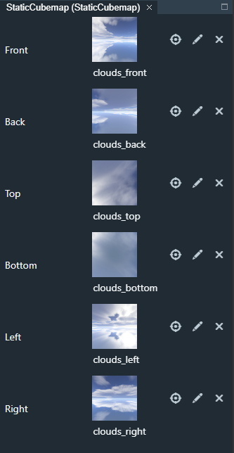

.. _cubemap:

=======
CubeMap
=======

A CubeMap is a set of 6 textures that can be used for a variety of effects, including reflections, or a background :ref:`Sky Box <sky-box>` environment.

To create a CubeMap:

1. Import 6 textures representing all the faces of the cubemap.
2. Click on the Create Button |create_button| in the :ref:`Assets View <assets-view>` and select **Static CubeMap**.
3. In the :ref:`Properties View <properties-view>`, link each of the 6 textures to their appropriate slot.

.. note::

	WebGL requires that all of the 6 textures must be exactly of the same size, be square, and have power-of-two dimensions.

