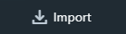

.. _fbx:

===
FBX
===

Spider supports FBX files that define static meshes or animated skinned characters.

.. _fbx-import:

Importing an FBX
================

To import an FBX, click on the Import Button |import_button| in the :ref:`Assets View <assets-view>`, and select your FBX(s) from disk.

During import, the Editor will process and transform it to some or all of the following assets:

* :ref:`Model <model>`
* :ref:`Material <material>`
* :ref:`Animation <animation>`
* :ref:`Texture <texture>`

After the import, you can start using the imported assets.

.. note::

	Textures embedded in the FBX will be automatically imported. 
	
	In contrast, external disk textures referenced by the FBX are imported differently. The Editor shows appropriate instructions on how to import them during the FBX import process.

Skinned Characters
==================

Upon import, the Editor creates the necessary Animation data, skeletons, and meshes.

We support a wide range of FBXs but our effort is focused on characters exported from the `Mixamo <https://www.mixamo.com>`_ platform.

