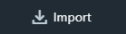

.. _texture:

=======
Texture
=======

Textures can be applied to any element on screen through 

To import an Texture, click on the Import Button |import_button| in the :ref:`Assets View <assets-view>`.

Texture Properties
==================

Filtering
---------

* **Linear** (default)
* **Nearest**

Repeat
------

* **Repeat On** (default)
* **Repeat Off**

Mipmaps
-------

Mipmaps are enabled by default, but it's recommended to disable them on textures used on 2D elements.

* **Mipmaps On** (default)

    .. image:: ./images/mipmaps-on.jpg

* **Mipmaps Off**

    .. image:: ./images/mipmaps-off.jpg

Publish format
--------------

When you publish your game, each texture is saved into an appropriate format, whithin the final game package.

In general, you never need to change the publish format manually, it is set by the Editor during texture Import.

Spider tries to keep a good balance between size and quality:

* **JPEG** works better for 3D graphics, especially textures with high frequency details. The size is acceptable, but there is a small quality loss.
* **PNG** is better for 2D graphics, such as Pixel Art, or super crisp, vector-like graphics, but they are generally heavier in size.

.. note::

	When your texture contains transparency, it is automatically set to PNG. Beware of unused Alpha channels!

