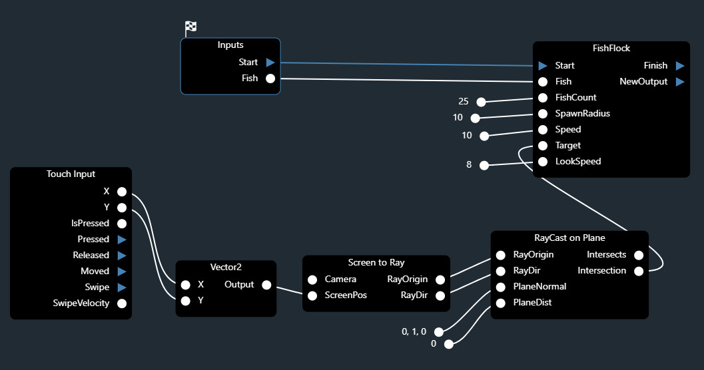

.. _behaviors:

Behaviors
=========

Behaviors are the primary way of creating functionality in the Spider Engine.

Behaviors are graphs that represent an execution flow. 

They have access to the engine through an :ref:`API <api>` and can perform a wide range of functionality.

.. note::

	Just like a traditional program, a behavior has a single starting point and an optional single exit point.

	
.. figure:: ./images/wip.svg
	:align: center
