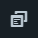
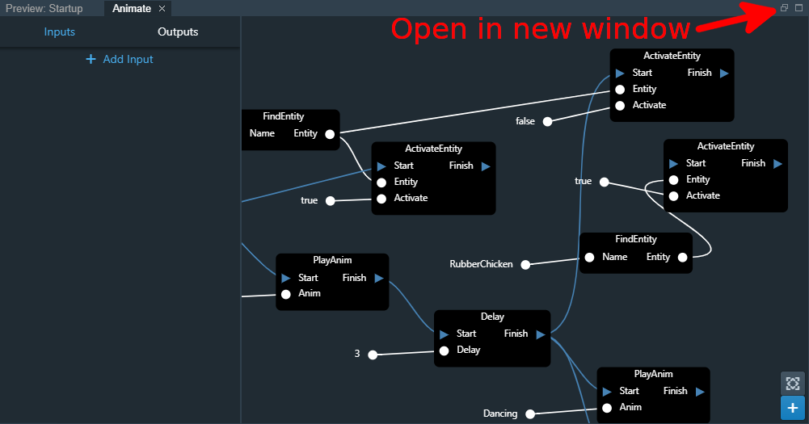

======
Editor
======

.. contents:: Content
    :local:

The `Spider Editor <https://spiderengine.io/editor>`_ is dedicated to creating content that runs on the Spider Engine Runtime.

It's accessible on the web, and a Desktop version is in development.

Views
=====

The editor is composed of several views, that can be shown through the Views Menu |views|

.. _assets-view:

Assets View
-----------

Lets you import, create, and manage all assets needed by the game.

    .. image:: ./images/assets.png

.. _scene-view:

Scene View
----------

Manages all the entities in the currently opened :ref:`Scene <scene>`.

You can drag-and-drop to change the hierarchy:

    * Drag Entity A on Entity B to make Entity A a child of Entity B.
    * Hold **Shift** while dropping Entity A to make it a sibling of Entity B as opposed to a child.

You can multi-select using **Ctrl-click** to edit or move multiple entities at the same time.

You can duplicate entities using **Ctrl-C** / **Ctrl-V**.

    .. image:: ./images/scene.png

.. _preview-area:

Preview Area
------------

Let's you edit the current scene.

Transform / Layout Manipulation
^^^^^^^^^^^^^^^^^^^^^^^^^^^^^^^

You can select an manipulate both 2D and 3D entities using industry-standard manipulation gizmos.

Play Mode
^^^^^^^^^

You can **Play** the game in the editor via the preview area. 

The editor handles a fully-fledged play session including Scene switches.

    .. image:: ./images/preview.png

.. _properties-view:

Properties View
---------------

Let's you edit the properties of selected objects.

When entities are selected, it lets you create and manage their components, and setup animations on them.

    .. image:: ./images/properties.png

.. _search:

Search View
-----------

Lets you find code in all code blocks and converters in the project.

    .. image:: ./images/search.png

.. _timeline:

Animation Timeline
------------------

Lets you create and edit animation tracks.

You can scrub the timeline to preview the animation in real-time.

You can also use the timeline's **Play Mode** to preview the animation.

    .. image:: ./animation/timeline.png

Editor Layout
-------------

You can customize the layout of the Editor any way you want. 

Your custom layout is saved and will be restored even if you close and re-open the Editor.

If you change your mind, you can restore the Layout to Factory Settings by clicking on **Reset Layout** from the Views menu |views|

Multi-monitor Support
---------------------

It can be very convenient to edit certain assets like :ref:`Shaders <shader>`, :ref:`Code Blocks <code-block>`, and :ref:`Behaviors <behaviors>`, in a separate monitor.

You can pop them out using the Pop out button located in the top-right of each tab you want to pop-out.

Undo / Redo
===========

Almost all operations done in the Editor are undoable. We are working to provide the most complete support possible.

    * **Ctrl-Z** to Undo
    * **Ctly-Y** to Redo
